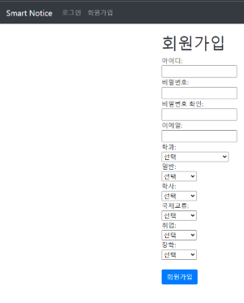
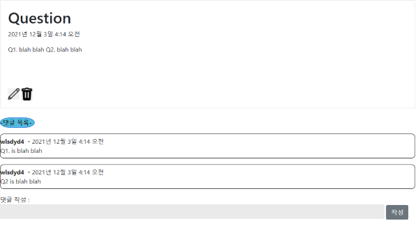
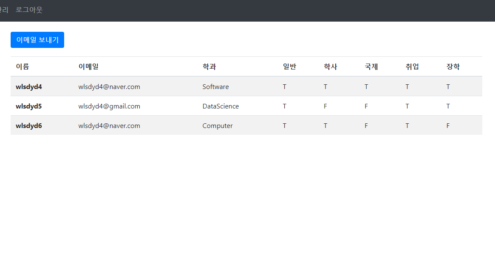

Features
========

😮Signup
------

* **(Complete) You can sign up for membership on the website. You can set the address to receive e-mail, your department, and the school notice list.**.

😮FAQ
---

* **(Complete) Frequent questions (FAQs) are provided on the website.**

😮bulltein board
--------------

* **(Complete) It provides a bulletin board service that anyone can answer when someone asks a question.**

😮email
-----

* **(Complete) Based on the information entered by the user when signing up as a member, what the user needs (school notice, department notice, etc.) can be received through e-mail every day.**